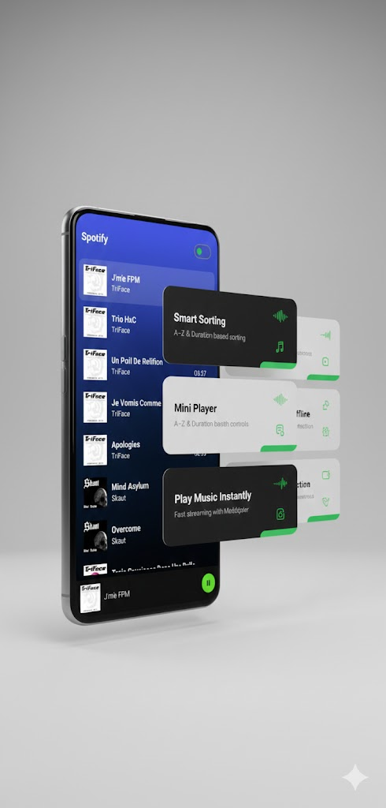

# 🎵 Spotify Android App (Kotlin)

A modern **Spotify-inspired Android music streaming application** built using **Kotlin**, **MVVM architecture**, and **Android MediaPlayer**.  
The app supports **online music streaming**, **smart sorting**, **offline detection**, and a smooth **mini-player experience**.

---

## 🎧 App Preview

<p align="center">
  
</p>

---

## Features

- 🎶 Online music streaming (Jamendo API)
- 🔀 Sort tracks by **Name** or **Duration**
- 📶 Real-time **Internet connectivity detection**
- ▶️ Mini player with play/pause controls
- 🖼️ Album artwork loading using **Glide**
- ⚡ Fast & smooth UI with Material Design
- 🧠 Clean architecture using **MVVM**

---

## Tech Stack

| Category        | Technology Used          |
|-----------------|--------------------------|
| Language        | Kotlin                   |
| UI              | XML + Material Design    |
| Architecture    | MVVM                     |
| Networking      | Jamendo Music API        |
| Media Playback  | Android MediaPlayer      |
| Image Loading   | Glide                    |
| State Handling  | LiveData                 |
| Connectivity    | ConnectivityManager      |

---

## How to Run the Project

1. **Clone the repository**
   ```bash
   git clone https://github.com/vivek84835V/Spotify-Android-App-Kotlin-.git

2. Sync **Gradle** files
3. Run the app on an **Emulator** or **Physical Device**

> ⚠️ **Note:** Active internet connection is required for streaming music.

---

## Developer

**Vivek Shimpi**  
Android Developer | Kotlin | MVVM  

- GitHub: [@vivek84835V](https://github.com/vivek84835V)
- LinkedIn: *https://www.linkedin.com/in/vivek-shimpi-/*

## ⭐ Support
Enjoyed this project?  
Give it a ⭐ on GitHub — it really helps and motivates me to keep creating awesome Android applications 🚀

